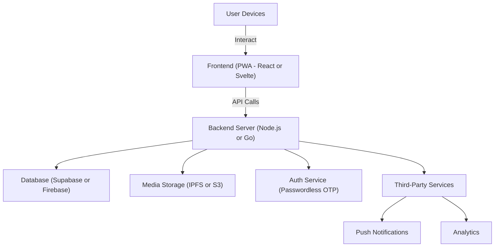
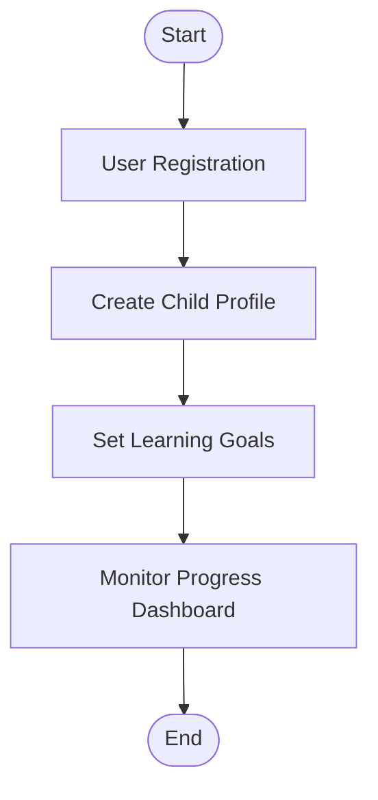
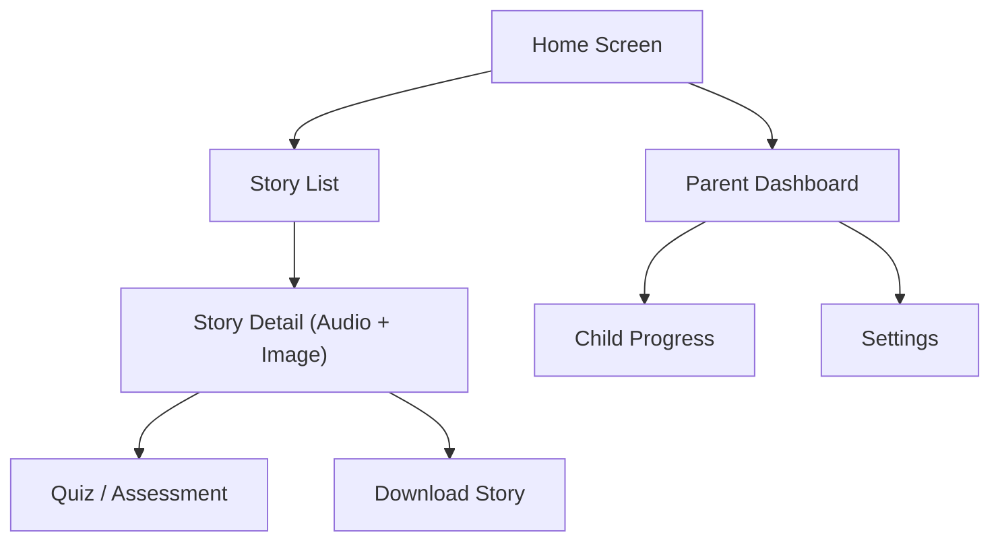
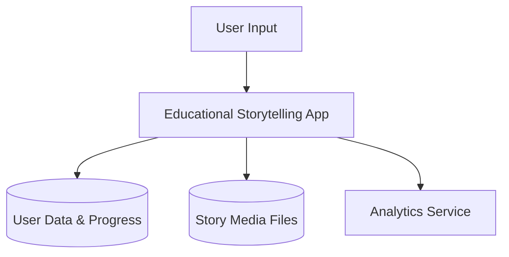
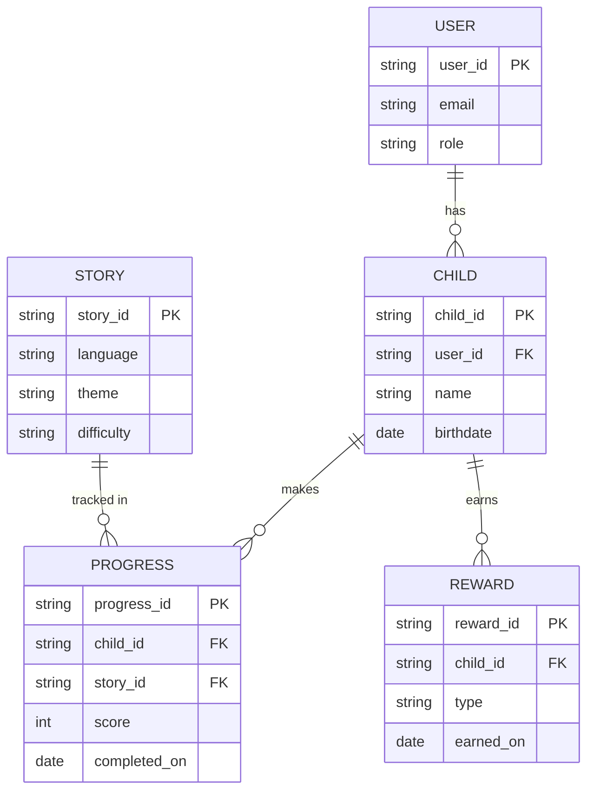
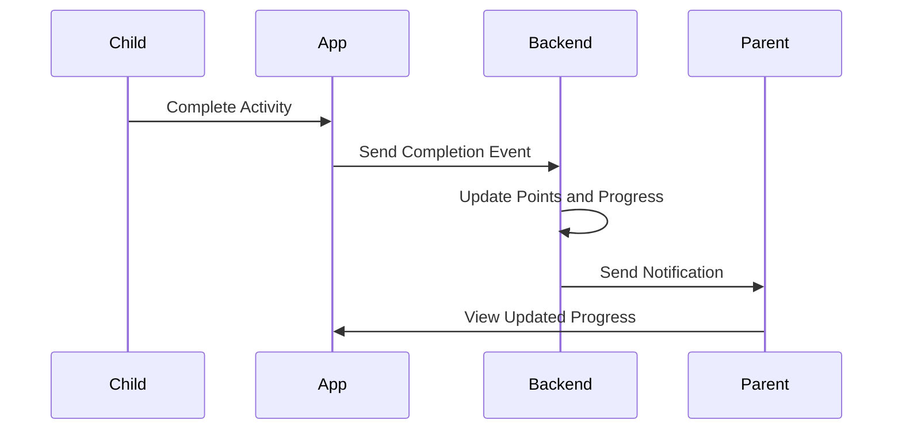
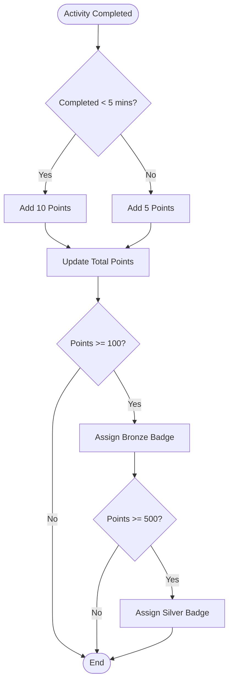
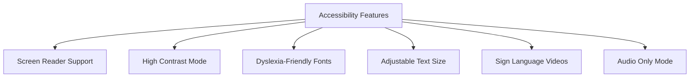

# **Project Requirements & Functional Specification**

**Project Title:** Community-Driven Educational Storytelling App for Children (Ages 4–10)

**Version:** 1.0

**Author:** Rafay Adeel

**Date:** August 11, 2025

---

# Table of Contents

1. [Introduction](#1-introduction)

   - [1.1 Overview](#11-overview)

2. [Target Audience](#2-target-audience)

3. [Goals & Objectives](#3-goals-objectives)

4. [Core Features & Functional Requirements](#4-core-features-functional-requirements)

   - [4.1 Storytelling](#41-storytelling)
   - [4.2 Vocabulary & Knowledge Tracking](#42-vocabulary-knowledge-tracking)
   - [4.3 Assessments & Gamification](#43-assessments-gamification)

5. [Community Contribution Features](#5-community-contribution-features)

   - [5.1 Roles](#51-roles)
   - [5.2 Contributor Dashboard](#52-contributor-dashboard)

6. [Offline Optimization & Accessibility](#6-offline-optimization-accessibility)

7. [Ethical Social Storytelling](#7-ethical-social-storytelling)

8. [Technical Stack & Implementation](#8-technical-stack-implementation)

9. [Performance & Optimization Plan](#9-performance-optimization-plan)

10. [Non-Functional Requirements](#10-non-functional-requirements)

    - [Security](#security)
    - [Scalability](#scalability)
    - [Maintainability](#maintainability)
    - [Reliability](#reliability)

11. [Future Roadmap](#11-future-roadmap)

12. [Diagrams](#12-diagrams)
    - [12.1 High-Level App Architecture Diagram](#121-high-level-app-architecture-diagram)
    - [12.2 User Flow Diagram](#122-user-flow-diagram)
    - [12.3 Wireframes / UI Screen Flow](#123-wireframes-ui-screen-flow)
    - [12.4 Data Flow Diagram (Level 0)](#124-data-flow-diagram-level-0)
    - [12.5 Entity Relationship Diagram (ERD)](#125-entity-relationship-diagram-erd)
    - [12.6 Use Case Diagram](#126-use-case-diagram)
    - [12.7 Sequence Diagram (Child completes activity)](#127-sequence-diagram-child-completes-activity)
    - [12.8 Gamification Logic Flowchart](#128-gamification-logic-flowchart)
    - [12.9 Accessibility Compliance Checklist](#129-accessibility-compliance-checklist)

---

## **1. Introduction**

### **1.1 Overview**

This project is an **educational web application** that blends **storytelling, vocabulary learning, interactive assessments, and community-driven content creation** for children aged 4–10.
It follows a **mobile-first Progressive Web App** approach, enabling **offline-first functionality** and **low-bandwidth optimization**, ensuring access in rural or under-connected areas.

The app supports **multi-language content**, culturally relevant stories, and integrates **ethical social storytelling campaigns** to connect learning with real-life values.
It also includes **adaptive learning**, **accessibility-first design**, and **low-data features** so children of all backgrounds can participate.

---

## **2. Target Audience**

**Primary Users:**

- Children aged 4–10 who consume and interact with stories

**Secondary Users:**

- Parents tracking child progress
- Teachers integrating app stories into lessons

**Contributors:**

- Story Writers, Narrators, Illustrators, Translators, Reviewers, Moderators
- Community educators and NGOs collaborating for local content

---

## **3. Goals & Objectives**

1. Deliver **engaging stories** in audio, illustrated, and lightweight animated formats
2. Build **vocabulary skills** with interactive word tracking
3. Provide **quizzes and gamified activities** to boost retention
4. Foster a **safe, inclusive community of contributors** for diverse content
5. Ensure **seamless offline use** for low-connectivity regions
6. Enable **safe, ethical sharing** of children’s progress
7. Support **inclusive learning modes** (sign language, dyslexia-friendly, bilingual)
8. Establish **content quality standards** through contributor training & review

---

## **4. Core Features & Functional Requirements**

### **4.1 Storytelling**

- **Modes:**

  - Voice-only narration (low data)
  - Voice + Image (picture book)
  - Optional lightweight animations (CSS/Lottie)
  - Text-only + audio mode for ultra-low bandwidth

- **Player Features:**

  - Play, Pause, Rewind, Replay
  - Word-by-word highlighting synced to narration
  - Adjustable narration speed
  - Show/hide text option
  - Bilingual display (native + target language)
  - Phonics mode for early readers
  - Download for offline access

- **Story Metadata:**

  - Language, Difficulty Level, Theme Tags, Duration
  - Target Age Group
  - Accessibility markers (sign language available, dyslexia-friendly font, etc.)

- **Special Modes:**

  - In-story comprehension prompts
  - Story remix (safe, pre-approved asset swaps)

---

### **4.2 Vocabulary & Knowledge Tracking**

- Auto-generated vocabulary list per story
- Each word:

  - Child-friendly definition
  - Example sentence
  - Audio pronunciation
  - Related image

- “Word Bank” per child with:

  - Learned words & words in progress
  - Adaptive review schedule based on performance

- Thematic learning cards after story completion
- Bilingual word view for cross-language reinforcement

---

### **4.3 Assessments & Gamification**

- **Quiz Types:**

  - Match word ↔ picture
  - Multiple-choice
  - Fill-in-the-blank (with audio/image clues)
  - Drag-and-drop sentence building

- **Gamification:**

  - Stars for quiz completion
  - Badges for milestones
  - Unlockable bonus stories
  - Seasonal/cultural event challenges
  - Optional leaderboards for class/school use

- **Adaptive Difficulty:**

  - Adjusts quiz complexity and vocabulary review speed

---

## **5. Community Contribution Features**

### **5.1 Roles**

- Story Writers, Narrators, Illustrators, Translators, Reviewers, Moderators
- NGOs/Educators as verified partners

### **5.2 Contributor Dashboard**

- Upload:

  - Text, Audio, Images
  - Theme, Difficulty, Language tags

- Version history with collaborative editing
- Peer review & voting
- Quality scoring tiers (Bronze/Silver/Gold)
- Contributor training hub with best practices
- AI-assisted translation/localization (child-safe)

---

## **6. Offline Optimization & Accessibility**

- **PWA** with install option
- **Service Workers** for caching
- **IndexedDB** for:

  - Stories, images, vocabulary, quizzes

- **Selective Pre-Caching** of favorites/recent stories
- **Lazy Loading** of media
- **P2P Sharing:** Bluetooth/WebRTC/Wi-Fi Direct/mesh network
- **Offline Bundles:** Downloadable “learning packs” of 10–15 stories

**Accessibility:**

- Screen reader support
- High-contrast & dyslexia-friendly mode
- Adjustable text size
- Sign language video inserts
- Multi-accent audio options
- Audio-only mode

---

## **7. Ethical Social Storytelling**

- **Parental Consent System** (mandatory opt-in)
- **Milestone Showcases** with safe avatars (no personal info)
- **Cultural Campaign Integration** (e.g., “Voices of \[Region]”)
- **NGO/School collaboration** for story sponsorship
- Admin-curated galleries of real-life impact stories

---

## **8. Technical Stack & Implementation**

**Frontend:**

- React/Svelte PWA
- HTML5 Audio API
- IndexedDB + LocalStorage
- Web Bluetooth / Capacitor plugin for P2P

**Backend:**

- Node.js + Express or Go
- Supabase/Firebase (real-time + offline persistence)
- IPFS/S3 for media
- Passwordless OTP/Magic Link authentication

---

## **9. Performance & Optimization Plan**

| Feature                          | Benefit                     |
| -------------------------------- | --------------------------- |
| Cache-first + SWR                | Fast offline access         |
| Selective pre-caching            | Saves storage               |
| Lazy loading + responsive media  | Loads only needed assets    |
| WebP/SVG formats                 | Small, high-quality media   |
| Minify/compress + code splitting | Faster load                 |
| Web Workers                      | Prevents UI blocking        |
| Background sync                  | Reliable uploads            |
| Lightweight audio mode           | Works on very low bandwidth |

---

## **10. Non-Functional Requirements**

**Security:**

- HTTPS for all traffic
- Encryption at rest/in transit
- Role-based contributor permissions

**Scalability:**

- CDN-backed hosting
- Modular architecture for feature growth

**Maintainability:**

- GitHub Actions CI/CD
- API docs via Swagger/OpenAPI

**Reliability:**

- Offline-first design
- Sync retries for failed uploads

---

## **11. Future Roadmap**

- AI-powered personalized story recommendations
- Speech recognition for retelling practice
- LMS integration for schools
- Parent/teacher discussion boards
- Open Educational Resource (OER) story archive
- Micro-donation model to sponsor translations
- Global seasonal storytelling events

# Diagrams

---

### 1. High-Level App Architecture Diagram (flowchart)



---

### 2. User Flow Diagram (Parent register & set goals)



---

### 3. Wireframes / UI Screen Flow (simple navigation)



---

### 4. Data Flow Diagram (Level 0)



---

### 5. Entity Relationship Diagram (ERD)



---

### 6. Use Case Diagram

```mermaid
usecaseDiagram
    actor Child
    actor Parent
    actor Teacher
    actor Admin

    rectangle "Educational Storytelling App" {
        (View Educational Content)
        (Play Games)
        (Complete Assessments)
        (Monitor Progress)
        (Set Learning Goals)
        (Receive Notifications)
        (Manage Content)
        (Moderate Contributions)
    }

    Child --> (View Educational Content)
    Child --> (Play Games)
    Child --> (Complete Assessments)

    Parent --> (Monitor Progress)
    Parent --> (Set Learning Goals)
    Parent --> (Receive Notifications)

    Teacher --> (Manage Content)
    Teacher --> (Monitor Progress)

    Admin --> (Manage Content)
    Admin --> (Moderate Contributions)
```

---

### 7. Sequence Diagram (Child completes activity)



---

### 8. Gamification Logic Flowchart



---

### 9. Accessibility Compliance Checklist (simple flowchart)



---
